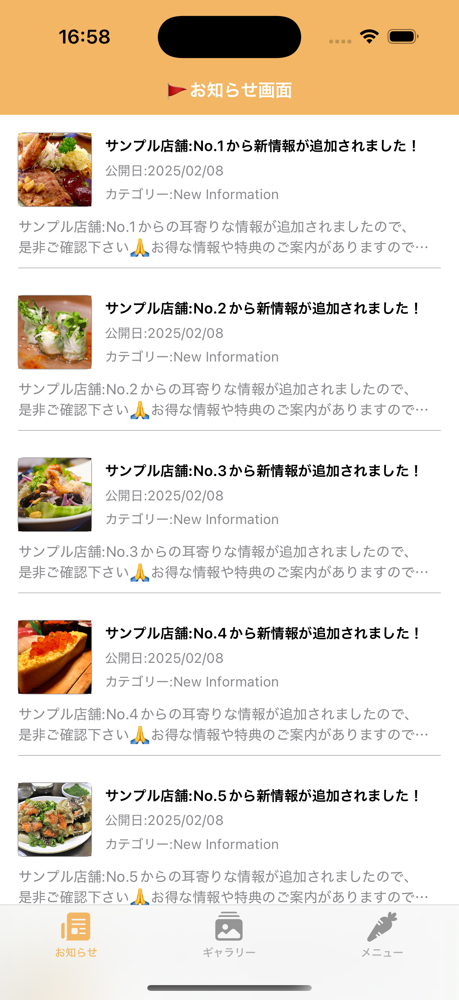
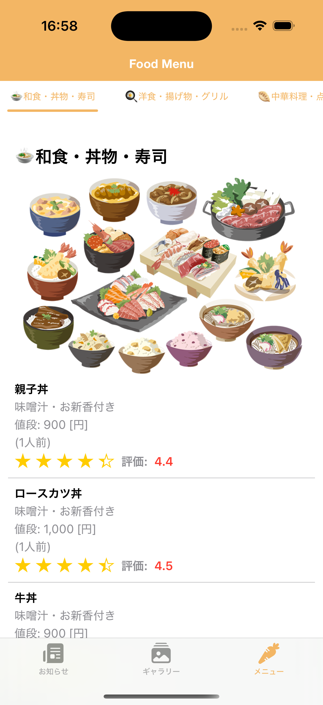
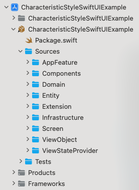
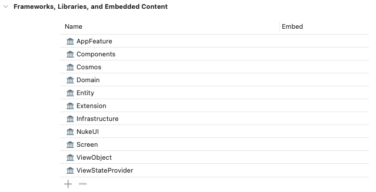

# CharacteristicStyleSwiftUIExample 

[ING] - 特徴的なUIの見た目をトレース&応用した実装サンプル例

これまでの復習も兼ねて、自分が気になったUIの見た目をトレースして応用した実装サンプル例です。

## 1. サンプル概要

__【認証画面】__

 

__【Gallery画面】__

`.matchedGeometryEffect`を利用して連続性があるサムネイル拡大表示と、引っ張って閉じるアニメーション＆インタラクションを加えています。

 

## 2. Mockサーバー環境構築

サンプルアプリ内では、APIモックサーバーから受け取ったJSON形式のレスポンスを画面に表示する処理を実現するために、node.js製の __「json-server」__ を利用して実現しています。（※こちらはTypeScript製のものを利用しています。）

このリポジトリをClone後に下記コマンドを実行することで、自分のローカル環境で動作させる事ができます。

サンプルアプリ内にAPIモックサーバーから受け取ったJSON形式のレスポンスを画面に表示する処理を実現するために、Node.js製の「JSONServer」というものを利用して実現しています。JSONServerに関する概要や基本的な活用方法につきましては下記のリンク等を参考にすると良いかと思います。

※ 自分のLocal環境に`node.js`と`yarn`がインストールされていない場合は、まずはその準備をする必要があります。

__【Local環境で再現する手順】__

```shell
# まずはMockサーバーの場所まで移動する
$ cd SimpleObservationViperExample/Backend
# 必要なpackageのインストール
$ yarn install
# Mockサーバーの実行
$ yarn start
```

※ 自分の手元でまっさらな状態から準備する場合は下記コマンドを順次実行するイメージになります。

__【Local環境で新規作成する場合の手順】__

```shell
# ⭐️ 必要な実行コマンド
# ① package.jsonの新規作成
$ yarn init -y
# ② 必要なライブラリのインストール
$ yarn add typescript
$ yarn add json-server
$ yarn add @types/json-server -D
```

※ こちらはMockサーバーを実行するために最低限必要な設定を記載した`package.json`になります。

__【package.json設定例】__

```json
{
  "name": "mock_server",
  "version": "1.0.0",
  "main": "server.ts",
  "license": "MIT",
  "dependencies": {
    "json-server": "^0.17.4",
    "typescript": "^5.2.2"
  },
  "scripts": {
    "start": "npx ts-node server.ts"
  },
  "devDependencies": {
    "@types/json-server": "^0.14.6"
  }
}
```

## 3. Module構成





